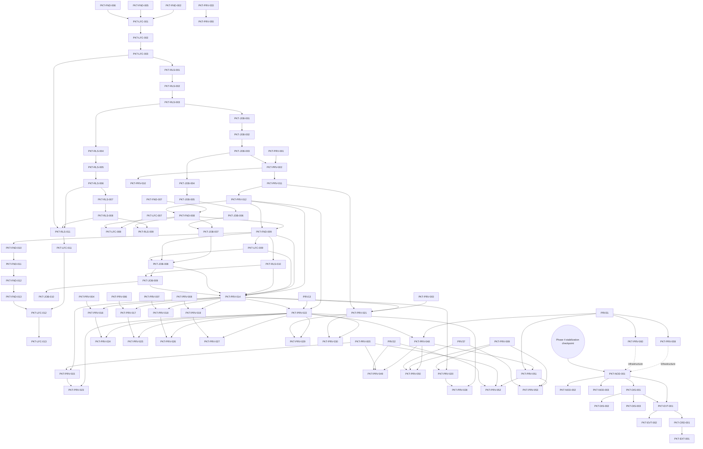

# Packet Dependency Graph

## Purpose

Provide the transitive dependency view for packet readiness. A packet may not start until all direct and transitive dependencies are merged.

## Readiness rule

A packet is **ready** only when:
- direct dependencies are merged
- transitive dependencies are merged
- any contract freeze point for the ownership group has passed

While `Phase 0.3` is active, no new non-refactor packet claim should start unless the live registry explicitly exempts it. Treat that checkpoint freeze as an additional global readiness rule on top of packet-local dependency edges.

## High-level dependency graph

## Clarification on extension ordering

`.1` freezes provider/model contract fields before jobs or prompt launch consume them.
The intended order is:

1. `PKT-PRV-012`
2. `PKT-FND-008`
3. `PKT-JOB-007`
4. `PKT-FND-009`
5. `PKT-LFC-009`
6. `PKT-RLS-010`
7. `PKT-JOB-008`
8. `PKT-JOB-009`

`.3` adds shorthand/default-launch ergonomics after the core `.2` path is verified. The intended order is:

1. `PKT-JOB-010`

`.4` adds provider prompt-tag surface synchronization after the core `.2` path is verified. The intended order is:

1. `PKT-PRV-014`
2. `PKT-PRV-015`
3. `PKT-PRV-016`
4. `PKT-PRV-017`
5. `PKT-PRV-018`
6. `PKT-PRV-019`
7. `PKT-PRV-020`
8. `PKT-PRV-021`

`.5` adds provider tag execution compliance and isolated provider implementation docs after the `.4` surface contract is frozen. The intended order is:

1. `PKT-PRV-022`
2. `PKT-PRV-023`
3. `PKT-PRV-024`
4. `PKT-PRV-025`
5. `PKT-PRV-026`
6. `PKT-PRV-027`
7. `PKT-PRV-028`
8. `PKT-PRV-029`
9. `PKT-PRV-030`

`.6` adds provider prompt-trigger launch behavior after the shared launch grammar and provider execution layer are already frozen. The intended order is:

1. `PKT-PRV-031`
2. `PKT-PRV-032` (Codex Option A baseline)
3. `PKT-PRV-033` (Claude Option A baseline)
4. `PKT-PRV-034` (Gemini)
5. `PKT-PRV-035` (Copilot)
6. `PKT-PRV-036` (Continue)
7. `PKT-PRV-037` (Cline)
8. `PKT-PRV-038` (local-openai/Qwen)

Note: `PKT-PRV-055` is Claude Option B (native hook) follow-on, depends on PKT-PRV-033 VERIFIED.

`.7` adds provider availability and auto-install orchestration after the trigger layer and provider execution layer are already frozen. The intended order is:

1. `PKT-PRV-039`
2. `PKT-PRV-040`
3. `PKT-PRV-041`
4. `PKT-PRV-042`
5. `PKT-PRV-043`
6. `PKT-PRV-044`
7. `PKT-PRV-045`
8. `PKT-PRV-046`
9. `PKT-PRV-047`

`.8` is the project release bootstrap extension tracked under Phase 2.3, so it is not repeated in this provider-facing cluster.

Phase 0.3 is the repository-structure checkpoint that should complete before additional non-refactor implementation resumes. Its intended order is:

1. `PKT-FND-010`
2. `PKT-FND-011`
3. `PKT-FND-012`
4. `PKT-FND-013`

Phase 1.4 is the installability correction layer that follows Phase 1 and Phase 2.3. Its intended order is:

1. `PKT-LFC-011`
2. `PKT-LFC-012`
3. `PKT-LFC-013`

`.9` adds live stream and progress capture after the trigger layer is already frozen and the shared stream contract is written down. The intended order is:

1. `PKT-PRV-048`
2. `PKT-PRV-049`
3. `PKT-PRV-050`
4. `PKT-PRV-072`
5. `PKT-PRV-073`

`.10` adds live input and interactive session control after live-stream capture is already frozen and the shared input contract is written down. The intended order is:

1. `PKT-PRV-051`
2. `PKT-PRV-052`
3. `PKT-PRV-053`

`.11` adds structured completion and result normalization after the live input/capture path is already frozen and the shared result contract is written down. The first packetized implementation order is:

1. `PKT-PRV-056`
2. `PKT-PRV-057`
3. `PKT-PRV-058`

`.12` adds provider optimization and shared workflow extensibility after the completion contract is written down. This phase is currently docs-only, so it does not yet introduce new packet ids.

`PKT-PRV-059` is centralized prompt syntax and alias configuration infrastructure. It depends on PKT-PRV-031 (shared bridge) and is available to all providers automatically through the shared prompt parser. It is infrastructure-level and does not block provider implementations.

`PKT-PRV-012` no longer depends on `PKT-JOB-007`; the earlier apparent cycle is resolved by treating provider/model field names as provider-owned contract output first.

The later node/discovery/federation/connectors extension line is separate from the provider line and begins only after the Phase 4 provider/runtime stabilization checkpoint. Its intended order is:

1. `PKT-NOD-001`
2. `PKT-NOD-002`
3. `PKT-NOD-003`
4. `PKT-DIS-001`
5. `PKT-DIS-002`
6. `PKT-DIS-003`
7. `PKT-EVT-001`
8. `PKT-EVT-002`
9. `PKT-CRD-001`
10. `PKT-EXT-001`

## Clarification on Phase 3 and Phase 4

`PKT-JOB-003` uses a **stub/mock provider seam only**. `PKT-PRV-002` and `PKT-PRV-010` attach real provider selection and health-check behavior in Phase 4 without changing Phase 3 job contracts.

## Validator requirement

`tools/validate_packet_dependencies.py` must:
- fail on unknown packet ids
- fail on direct circular dependencies
- detect forward-phase references without a seam note
- emit a topological order report

## DRAFT future enhancements

- merge-queue suggestion output
- owner readiness dashboard
