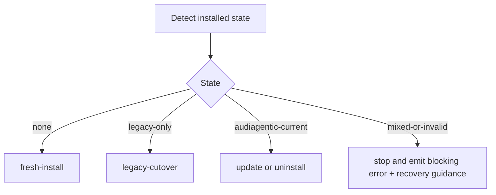

# Installation, Update, Cutover, and Uninstall

## Purpose

This document defines lifecycle operations for fresh install, update, legacy cutover, and uninstall.

## Hard requirements

- release artifacts only
- no Git clone required
- component and provider selection supported
- legacy cutover supported
- current AUDiaGentic uninstall supported
- lifecycle modules separated by concern and version
- the installable tracked baseline must be applied from a canonical managed inventory rather than ad hoc copy lists

## Lifecycle states

- `none`
- `legacy-only`
- `audiagentic-current`
- `mixed-or-invalid`

### Detection rules

`legacy-only` if:
- legacy install markers are present
- `.audiagentic/` is absent

`audiagentic-current` if:
- AUDiaGentic install manifest exists
- `.audiagentic/project.yaml` exists or project enablement marker exists
- no legacy-only blockers remain

`mixed-or-invalid` if any of the following are true:
- both legacy and AUDiaGentic managed workflow files are active
- conflicting install manifests exist
- `.audiagentic/` exists but no matching install manifest can be found
- partial cutover markers exist

## Dispatcher



## Modes

Every lifecycle action supports:
- `plan`
- `apply`
- `validate`

### `plan`
- no destructive changes
- emits machine-readable plan
- emits human-readable summary

### `apply`
- executes changes
- writes state checkpoints
- stops on blocking error

### `validate`
- verifies final state only
- must not mutate project state

## Recovery and checkpoints

For destructive actions, checkpoints must be written under:
- `.audiagentic/runtime/lifecycle/` for current installs
- temp lifecycle work area during cutover before `.audiagentic/` exists

Checkpoint phases:
- `detected`
- `planned`
- `pre-destructive`
- `post-migration`
- `post-cleanup`
- `validated`

Rollback guarantee:
- before `pre-destructive`, full restart from plan is allowed
- after `pre-destructive`, rollback is limited to preserving new state and reporting manual recovery guidance

## CLI surface

Canonical lifecycle CLI:

```text
audiagentic lifecycle <fresh-install|update|legacy-cutover|uninstall> --mode <plan|apply|validate>
```

Common flags:
- `--project-root PATH`
- `--install-root PATH`
- `--component ID` (repeatable)
- `--provider ID` (repeatable)
- `--json`
- `--keep-config`
- `--remove-config`
- `--keep-workflows`
- `--remove-workflows`

Exit codes:
- `0` success
- `1` blocking error
- `2` validation failure
- `3` unsafe mixed-or-invalid state
- `4` user-action-required warning treated as failure by caller
- `5` internal lifecycle fault

## Uninstall defaults

Default uninstall behavior:
- remove `.audiagentic/runtime/`
- preserve tracked docs under `docs/`
- preserve `.audiagentic/project.yaml`, `components.yaml`, `providers.yaml`, `prompt-syntax.yaml`, and managed prompt/instruction baseline assets unless explicitly removed by a later baseline-sync policy
- preserve user-modified managed workflow files unless `--remove-workflows` is explicitly passed

## Installable baseline rule

Fresh install, update, cutover, and bootstrap must distinguish between:
- tracked installable baseline assets
- generated tracked outputs
- runtime-only state

Runtime-only state under `.audiagentic/runtime/` must never be copied as install baseline.
Tracked prompt templates, prompt syntax, and managed provider instruction assets are part of
the installable baseline and must be handled by the shared baseline sync rules once that
extension lands.

The canonical install inventory and sync-mode classification live in
`48_Installable_Project_Baseline_and_Managed_Asset_Synchronization.md`.


## Recovery procedures by checkpoint

### detected
- safe to re-run `plan` or `apply`
- no project mutation should have occurred

### planned
- safe to re-run `plan` or `apply`
- compare the newly emitted plan with the prior plan if manual review was already performed

### pre-destructive
- backups and migration reports must exist before any destructive cleanup begins
- safe to re-run only if no destructive step has started

### post-migration
- treat new AUDiaGentic project config and migrated docs as source of truth
- do not attempt to restore legacy runtime state
- operator should run `validate` before any cleanup retry

### post-cleanup
- legacy state may already be partially or fully removed
- rerun only in `validate` mode first; if validation fails, emit manual-recovery guidance and stop

### validated
- lifecycle operation is complete
- subsequent reruns should be treated as normal `update` or `uninstall` operations according to detected state

## Mixed-or-invalid recovery guidance

When `mixed-or-invalid` is detected, the lifecycle dispatcher must:
1. emit a blocking error and machine-readable diagnostics
2. list the markers that caused the classification
3. recommend the smallest safe operator action, for example:
   - remove stale partial cutover marker
   - choose one managed workflow as authoritative
   - restore missing install manifest from backup or rerun cutover in `plan` mode

## Example non-destructive lifecycle commands

```text
audiagentic lifecycle fresh-install --mode plan --project-root . --json
audiagentic lifecycle legacy-cutover --mode validate --project-root .
audiagentic lifecycle update --mode apply --project-root . --component release-audit-ledger
```
