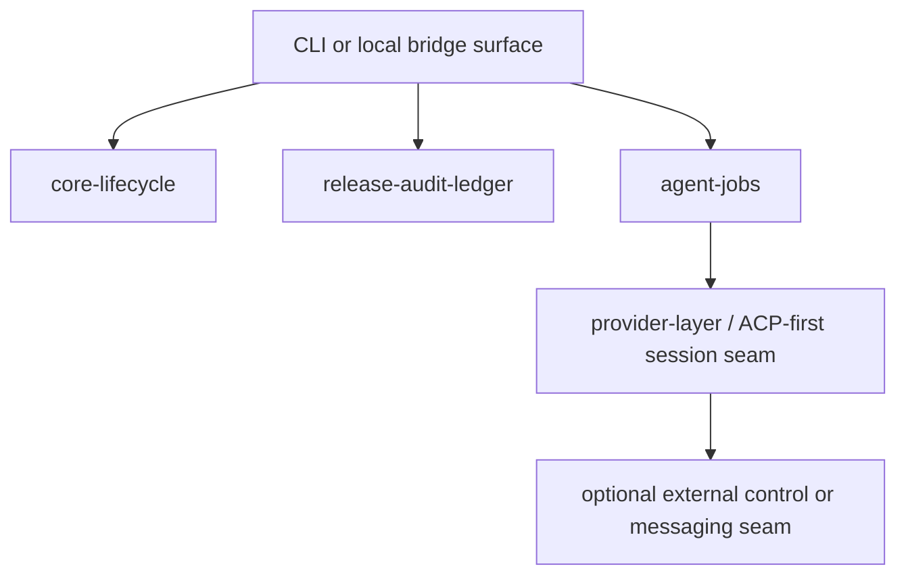

# Agent Server and Execution Topology

## Current topology direction

An always-on server is still optional, but the architecture is no longer framed as a purely later or thin afterthought. The active direction is:

- in-process core services remain the baseline execution path
- provider and session handling should be ACP-first at the internal seam
- OpenACP is the preferred external messaging/control direction when an external control surface is introduced
- external messaging/control is distinct from the internal release, lifecycle, and planning cores

## Baseline execution topology

## Internal versus external responsibilities

- `core-lifecycle`, `release-audit-ledger`, and `agent-jobs` remain internal project-owned cores
- provider normalization, session provenance, and runtime artifact ownership remain internal responsibilities
- any external messaging or control surface must consume canonical contracts rather than redefine them
- the retired Discord-specific overlay is not part of the active topology

## Optional external seam

Later phases may expose the same services through a more explicit boundary. To support that without base rewrites:

- services must accept explicit context objects
- services must not depend on global mutable state
- services must return typed result objects defined in common contracts
- external control or messaging surfaces should attach to the canonical bridge/session seam rather than invent a provider-specific overlay path

## Not in scope for this baseline

- Discord as an active first-class overlay path
- provider-specific external control contracts that bypass canonical bridge behavior
- distributed session ownership without the canonical ACP/OpenACP seam being defined first
