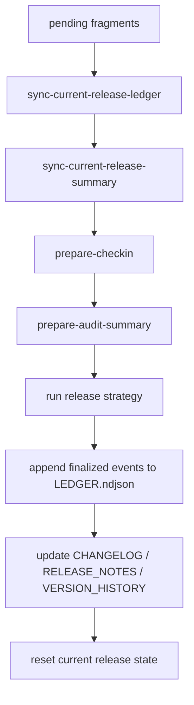

# Release, Audit, and Change Ledger

## Purpose

This subsystem must work before agent jobs. It provides durable project records and deterministic release preparation.

## Tracked release files

```text
docs/releases/
  CHANGELOG.md
  RELEASE_NOTES.md
  CHECKIN.md
  AUDIT_SUMMARY.md
  VERSION_HISTORY.md
  CURRENT_RELEASE.md
  CURRENT_RELEASE_LEDGER.ndjson
  LEDGER.ndjson
```

## Runtime support files

```text
.audiagentic/runtime/ledger/
  fragments/
  sync/
  temp/
```

## Fragment-first rule

Raw change capture must go to runtime fragments first. Tracked files are regenerated by deterministic scripts.

## Fragment schema and naming

Each fragment file contains one `ChangeEvent` and must be named:

```text
<timestamp>__<event-id>.json
```

## Sync semantics

### `record-change-event`
- writes one fragment file only
- must not modify tracked docs
- must fail if `event-id` already exists in the target fragment directory

### `sync-current-release-ledger`
- acquires an exclusive sync lock under `.audiagentic/runtime/ledger/sync/lock`
- reads all pending fragments
- stable-sorts by `timestamp-utc`, then `event-id`
- merges by `event-id`
- writes a temp file
- atomically replaces `docs/releases/CURRENT_RELEASE_LEDGER.ndjson`
- marks synced fragment ids in a sync manifest
- must be idempotent if rerun with no new fragments

Duplicate handling:
- same `event-id` with byte-identical payload: ignore duplicate on sync and log notice
- same `event-id` with different payload: fail sync with blocking error

### `sync-current-release-summary`
- regenerates `docs/releases/CURRENT_RELEASE.md` from `CURRENT_RELEASE_LEDGER.ndjson`
- same ledger input must produce same summary output

## Release finalization checkpoints



Checkpoint files required:
- `finalize.detected.json`
- `finalize.prepared.json`
- `finalize.strategy-complete.json`
- `finalize.historical-ledger-complete.json`
- `finalize.tracked-docs-complete.json`
- `finalize.reset-complete.json`

Recovery rule:
- if interrupted before `historical-ledger-complete`, rerun may restart from sync
- if interrupted after `historical-ledger-complete`, rerun must resume from tracked-doc regeneration and must not append historical events twice

## Historical ledger requirements

Finalized entries appended to `LEDGER.ndjson` must include:
- `release-version`
- `release-tag`
- `released-at`
- `release-record-id`
- `status: released`

## Freshness rule for tracked docs

- `CURRENT_RELEASE_LEDGER.ndjson` is refreshed only by explicit sync/finalize scripts
- `CURRENT_RELEASE.md` is refreshed only by explicit summary sync/finalize scripts
- `CHECKIN.md` and `AUDIT_SUMMARY.md` are refreshed only by their dedicated scripts


### Lock timeout and stale lock handling

The sync lock file must contain at minimum:
- process id
- hostname
- acquired-at timestamp
- command name

Timeout rules:
- default lock acquisition timeout: **60 seconds**
- if the lock owner is no longer running or the lock age exceeds **10 minutes**, the lock is considered stale
- stale lock cleanup must require an explicit warning record before the lock is replaced

Failure rules:
- timeout waiting for an active non-stale lock returns exit code `3`
- stale lock replacement must be logged to the lifecycle/event stream for later audit

### Recommended sync cadence

MVP guidance:
- `record-change-event` may be called many times during work
- `sync-current-release-ledger` should run on explicit operator request, before check-in preparation, and before release finalization
- automatic background sync is out of scope for MVP

### Git churn mitigation

To reduce tracked-file churn:
- change events are always written to runtime fragments first
- tracked release docs are regenerated only by explicit sync/finalize commands
- branch workers should prefer fragment accumulation during implementation and sync only at review/check-in boundaries

See also the draft operational notes for future-scale considerations.
