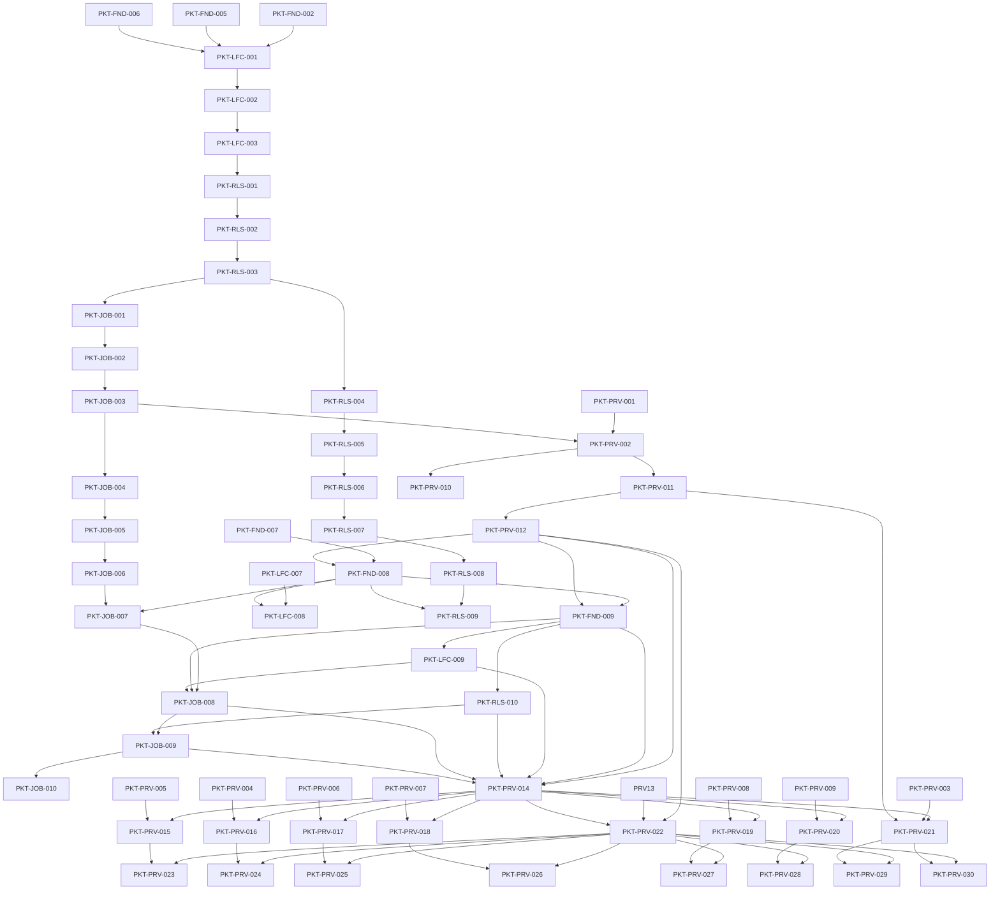

# Packet Dependency Graph

## Purpose

Provide the transitive dependency view for packet readiness. A packet may not start until all direct and transitive dependencies are merged.

## Readiness rule

A packet is **ready** only when:
- direct dependencies are merged
- transitive dependencies are merged
- any contract freeze point for the ownership group has passed

## High-level dependency graph

## Clarification on .1 and .2 extension ordering

`.1` freezes provider/model contract fields before jobs or prompt launch consume them.
The intended order is:

1. `PKT-PRV-012`
2. `PKT-FND-008`
3. `PKT-JOB-007`
4. `PKT-FND-009`
5. `PKT-LFC-009`
6. `PKT-RLS-010`
7. `PKT-JOB-008`
8. `PKT-JOB-009`

`.3` adds shorthand/default-launch ergonomics after the core `.2` path is verified. The intended order is:

1. `PKT-JOB-010`

`.4` adds provider prompt-tag surface synchronization after the core `.2` path is verified. The intended order is:

1. `PKT-PRV-014`
2. `PKT-PRV-015`
3. `PKT-PRV-016`
4. `PKT-PRV-017`
5. `PKT-PRV-018`
6. `PKT-PRV-019`
7. `PKT-PRV-020`
8. `PKT-PRV-021`

`.5` adds provider tag execution compliance and isolated provider implementation docs after the `.4` surface contract is frozen. The intended order is:

1. `PKT-PRV-022`
2. `PKT-PRV-023`
3. `PKT-PRV-024`
4. `PKT-PRV-025`
5. `PKT-PRV-026`
6. `PKT-PRV-027`
7. `PKT-PRV-028`
8. `PKT-PRV-029`
9. `PKT-PRV-030`

`.6` adds provider prompt-trigger launch behavior after the shared launch grammar and provider execution layer are already frozen. The intended order is:

1. `PKT-PRV-031`
2. `PKT-PRV-032`
3. `PKT-PRV-033`
4. `PKT-PRV-034`
5. `PKT-PRV-035`
6. `PKT-PRV-036`
7. `PKT-PRV-037`
8. `PKT-PRV-038`

`.7` adds provider availability and auto-install orchestration after the trigger layer and provider execution layer are already frozen. The intended order is:

1. `PKT-PRV-039`
2. `PKT-PRV-040`
3. `PKT-PRV-041`
4. `PKT-PRV-042`
5. `PKT-PRV-043`
6. `PKT-PRV-044`
7. `PKT-PRV-045`
8. `PKT-PRV-046`
9. `PKT-PRV-047`

`PKT-PRV-012` no longer depends on `PKT-JOB-007`; the earlier apparent cycle is resolved by treating provider/model field names as provider-owned contract output first.

## Clarification on Phase 3 and Phase 4

`PKT-JOB-003` uses a **stub/mock provider seam only**. `PKT-PRV-002` and `PKT-PRV-010` attach real provider selection and health-check behavior in Phase 4 without changing Phase 3 job contracts.

## Validator requirement

`tools/validate_packet_dependencies.py` must:
- fail on unknown packet ids
- fail on direct circular dependencies
- detect forward-phase references without a seam note
- emit a topological order report

## DRAFT future enhancements

- merge-queue suggestion output
- owner readiness dashboard
