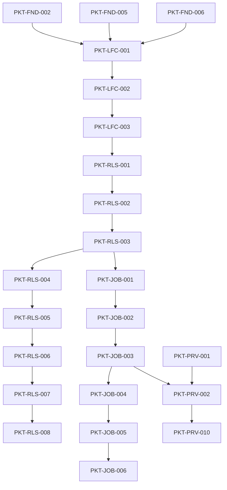

# Packet Dependency Graph

## Purpose

Provide the transitive dependency view for packet readiness. A packet may not start until all direct and transitive dependencies are merged.

## Readiness rule

A packet is **ready** only when:
- direct dependencies are merged
- transitive dependencies are merged
- any contract freeze point for the ownership group has passed

## High-level dependency graph

## Clarification on Phase 3 and Phase 4

`PKT-JOB-003` uses a **stub/mock provider seam only**. `PKT-PRV-002` and `PKT-PRV-010` attach real provider selection and health-check behavior in Phase 4 without changing Phase 3 job contracts.

## Validator requirement

`tools/validate_packet_dependencies.py` must:
- fail on unknown packet ids
- fail on direct circular dependencies
- detect forward-phase references without a seam note
- emit a topological order report

## DRAFT future enhancements

- merge-queue suggestion output
- owner readiness dashboard
