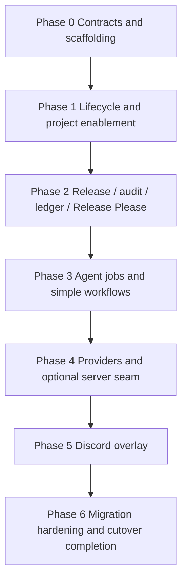

# System Overview

## Purpose

AUDiaGentic is a clean replacement project for the legacy platform. It is designed to start with a small, deterministic MVP and then grow in clearly bounded phases.

## Design priorities

1. **MVP first** — avoid complex orchestration until the base is stable.
2. **Contract first** — shared contracts must be explicit before parallel implementation begins.
3. **Project local state** — each enabled project owns its own runtime state under `.audiagentic/`.
4. **Release before jobs** — release, audit, and ledger come before agent jobs.
5. **Optional overlays** — Discord and later server/seam features must remain optional.
6. **Low rewrite growth path** — new layers should add on top of stable contracts rather than force base rewrites.

## Tracked vs runtime material

### Tracked in git
- `docs/specifications/...`
- `docs/implementation/...`
- `docs/releases/...`
- `docs/decisions/...`
- `.audiagentic/project.yaml`
- `.audiagentic/components.yaml`
- `.audiagentic/providers.yaml`

### Git ignored runtime
- `.audiagentic/runtime/...`

## Delivery order

## Non-goals for MVP

- no complex graph workflow engine
- no mandatory server runtime
- no mandatory AI for release correctness
- no MCP-based Discord design in v1
- no migration of legacy runtime state
