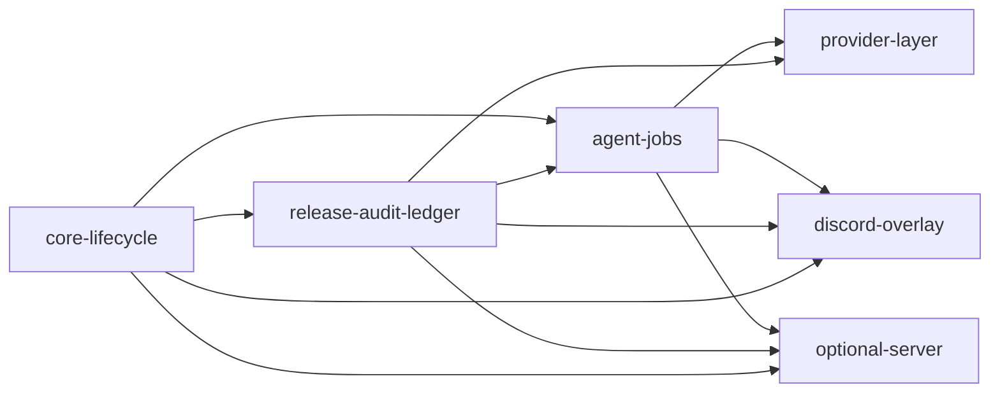

# Core Boundaries and Dependency Rules

## Mandatory dependency rules

### Core subsystems
- `core-lifecycle`
- `release-audit-ledger`
- `agent-jobs`
- `provider-layer`

### Optional subsystems
- `discord-overlay`
- `optional-server`

## Allowed dependencies

## Forbidden dependencies

- `release-audit-ledger` must not depend on `discord-overlay`
- `agent-jobs` must not depend on `discord-overlay`
- `release-audit-ledger` must not require local AI
- `agent-jobs` must not require Discord for correctness
- `optional-server` must not become required for in-process execution

## Implication for implementation

Every cross-module interaction must go through a documented contract, schema, or script boundary.
