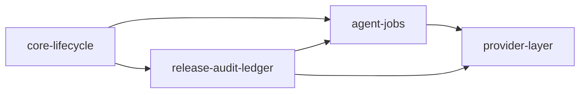

# Core Boundaries and Dependency Rules

> **v3 structural refactor complete.** Domain names updated from pre-refactor vocabulary
> (`contracts`, `config`, `scoping`, `streaming`, `observability`, `core`) to the current
> v3 canonical domains. See `docs/refactor/v3-migration-report.md` for migration history.

## Active subsystem taxonomy

### Core subsystems
- `core-lifecycle`
- `release-audit-ledger`
- `agent-jobs`
- `provider-layer`

### Optional subsystems
- `optional-server` (deferred — no active implementation)

### Optional extension subsystems (reserved, not yet active)
- `knowledge`
- `nodes`
- `discovery`
- `federation`
- `connectors`

## Repository-domain dependency rules (v3)

The following rules are canonical for code placement and import repair inside `src/audiagentic/`.

### Repository domains

Active:
- `foundation` (contains `contracts/` and `config/`)
- `planning`
- `execution`
- `interoperability` (contains `providers/` and `protocols/`)
- `runtime` (contains `lifecycle/` and `state/`)
- `release`
- `channels`

Deferred scaffolding:
- `knowledge` (scaffold only — no active implementation)

### Allowed repository-domain dependencies

| Domain | May depend on |
|---|---|
| `foundation` | no repository-domain dependencies |
| `planning` | `foundation` |
| `execution` | `foundation`, `runtime`, `interoperability` |
| `interoperability` | `foundation`, `execution` (one-way; see gemini seam note) |
| `runtime` | `foundation` |
| `release` | `foundation`, `runtime` |
| `channels` | `foundation`, `runtime`, `execution`, `release` |
| `knowledge` | `foundation` |

### Forbidden repository-domain dependencies

- `foundation` must not depend on any other domain
- `runtime` must not depend on `channels`, `execution`, `release`, or `interoperability`
- `execution` must not depend on channel formatting or rendering internals
- `channels` must not depend on execution orchestration internals beyond approved entrypoints
- `release` must not depend on `channels` or `execution`
- `knowledge` must not depend on `execution`, `channels`, or `release` during scaffold phase

### Known approved cross-layer seam

`interoperability/providers/adapters/gemini.py` imports from `execution.jobs.prompt_launch` and
`execution.jobs.prompt_parser`. This is a documented one-way dependency (interoperability → execution)
that is approved and must not be expanded without review.

## Allowed subsystem dependencies (conceptual)

## Forbidden subsystem dependencies

- `release-audit-ledger` must not require local AI
- `agent-jobs` must not require any external messaging/control surface for correctness
- `optional-server` must not become required for in-process execution
- Reserved extension roots must remain optional and must not become required for
  single-node correctness, release correctness, or prompt-launch correctness

## Implication for implementation

Every cross-module interaction must go through a documented contract, schema, or script boundary.
The later extension layers are additive optional subsystems, not replacements for the baseline
`core-lifecycle`, `release-audit-ledger`, `agent-jobs`, or `provider-layer` contracts.
