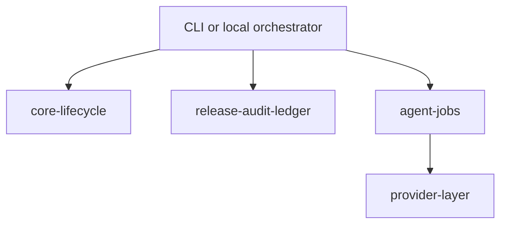

# Agent Server and Execution Topology

## Scope in this baseline

An always-on server is **not required for MVP**.

The baseline architecture uses in-process services first. A future optional server seam may be added only if the contracts below remain stable.

## MVP execution topology

## Optional server seam

Later phases may expose the same services through a thin boundary. To support that later without base rewrites:
- services must accept explicit context objects
- services must not depend on global mutable state
- services must return typed result objects defined in common contracts

## Not in scope for MVP

- remote control plane
- distributed session ownership
- server-only execution path
